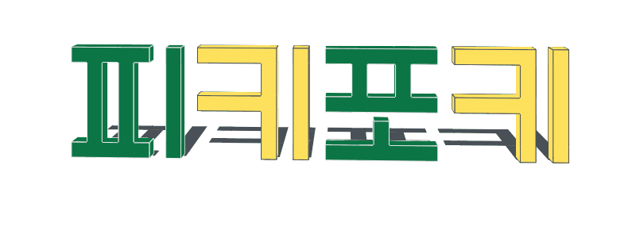
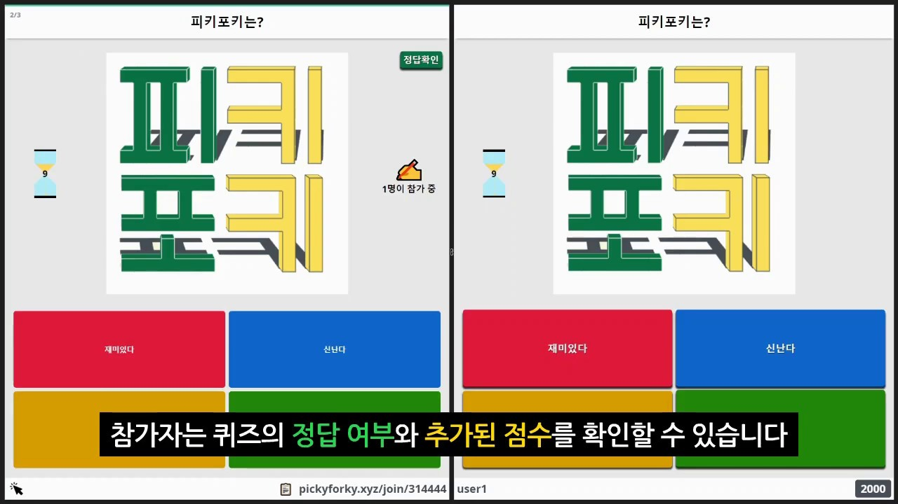
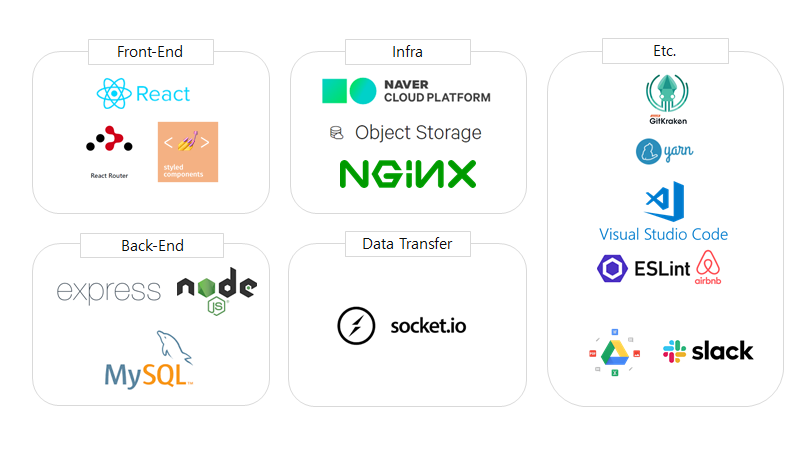
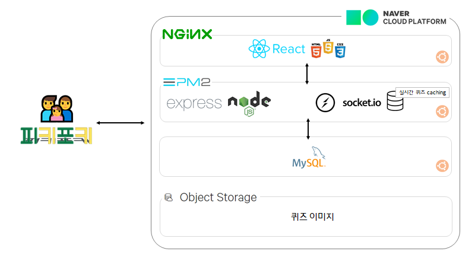
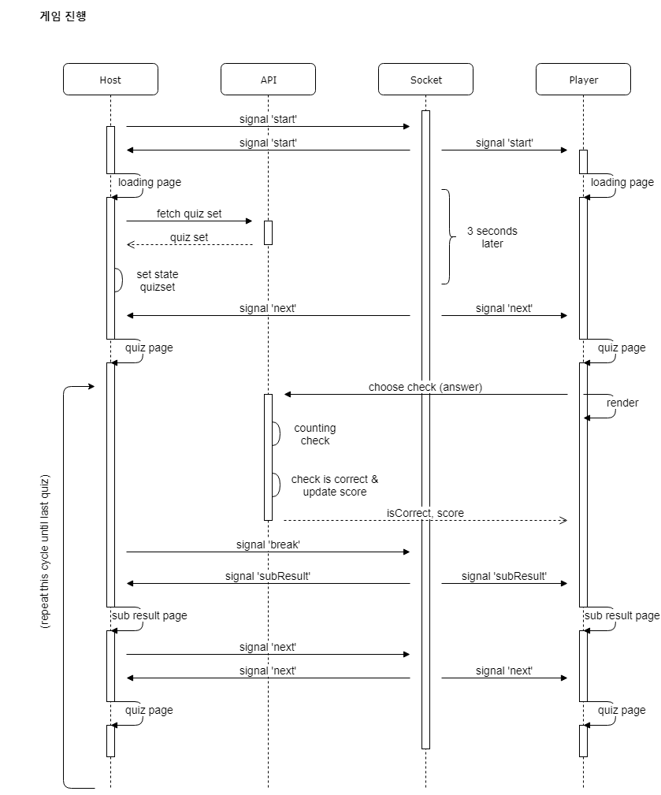

<p align='middle'>
<a href='http://pickyforky.xyz'></a></p>
<p align='middle'>   <a href="https://github.com/connect-foundation/2019-07/wiki"/></a>    </p>

<h1 align='middle'><a href='http://pickyforky.xyz'>🏠http://pickyforky.xyz</a></h1>
<p align='middle'>
<strong>피</strong>키포키는 학습을 도와줄 <u>🙆‍♂️🙅‍♀️실시간 퀴즈 플랫폼</u>이에요.<br>
 <strong>키</strong>즈부터 성인까지 👨‍👨‍👧‍👦 <u>넓은 연령대</u>를 타겟으로 해요.<br>
 💯<strong><u>포</strong>인트(점수) 기반의 경쟁 요소</u>로 재미를 더했어요.<br>
<strong>키</strong>(퀴)즈의 📊<u>시각화된 결과</u>로 강의의 피드백을 제공해요!<br>
<br>
피키포키로 더 나은 학습 경험을 제공하세요 😊
</p>

---

📚[위키](https://github.com/connect-foundation/2019-07/wiki)에선 더 다양한 정보들을,  
🗂[프로젝트](https://github.com/connect-foundation/2019-07/projects)에선 개발 과정을,  
피키포키의 다양한 모습을 살펴보세요!

## 목차

1. [팀원 소개](#팀원-소개)
2. [프로젝트 소개](#프로젝트-소개)  
   2-1. [프로젝트 시연 및 소개 영상](#-프로젝트-시연-및-소개-영상)  
   2-2. [사용 기술](#-사용-기술)  
   2-3. [배포 구조](#-배포-구조)  
   2-4. [게임 진행 흐름도](#-게임-진행-흐름도)  
   2-5. [프로젝트 목표](#프로젝트-목표)
3. [실행 방법](#실행-방법)

---

## 👨‍👨‍👧팀원 소개

<table>
  <tr>
  <td align="center">
  <sub>
    움직이는게 좋은 CSS 마스터
  </sub>
  </td>
  <td align="center">
  <sub>
    뭐든 정리하고 싶은 정리러
  </sub>
  </td>
  <td align="center">
  <sub>
    133% 작업률을 달성하고있는
  </sub>
  </td>
  <td align="center">
  <sub>
    사라진
  </sub>
  </td>
  </tr>
  <tr>
    <td align="center"><a href="https://github.com/ocy1011"><br /><sub><b>오창영</b></sub></a><br /></td>
    <td align="center"><a href="https://github.com/2ssue"><br /><sub><b>이수정</b></sub></a><br /></td>
    <td align="center"><a href="https://github.com/changicho"><br /><sub><b>조찬기</b></sub></a><br /></td>
    <td align="center"><a href="https://github.com/leecoders"><br /><sub><b>이재민</b></sub></a><br /></td>
  </tr>
    <tr>
  <td align="center">
    <sub>
    <a href="https://github.com/connect-foundation/2019-07/wiki/works-%EC%98%A4%EC%B0%BD%EC%98%81">피키포키의 오창영 소개서</a></sub>
  </td>
  <td align="center">
    <sub>
    <a href="https://github.com/connect-foundation/2019-07/wiki/works-%EC%9D%B4%EC%88%98%EC%A0%95">피키포키의 이수정 소개서</a>
    </sub>
  </td>
  <td align="center">
    <sub>
    <a href="https://github.com/connect-foundation/2019-07/wiki/works-%EC%A1%B0%EC%B0%AC%EA%B8%B0">피키포키의 조찬기 소개서</a></sub>
  </td>
  <td align="center">
    <a href="https://github.com/connect-foundation/2019-07/wiki/works-%EC%9D%B4%EC%9E%AC%EB%AF%BC">...👻</a>
  </td>
  </tr>
</table>

### 피키포키 개발자의 하루하루 컨디션

저희는 데일리 스크럼마다, 그날의 컨디션을 기록하고 서로 확인했어요!  
피키포키 개발자들의 가장 높았던 컨디션 점수는 몇 점이었을까요? [데일리 스크럼 보러가기](https://github.com/connect-foundation/2019-07/wiki/%EB%8D%B0%EC%9D%BC%EB%A6%AC-%EC%8A%A4%ED%81%AC%EB%9F%BC-%EB%AA%A8%EC%9D%8C%EC%A7%91)

---

## 프로젝트 소개

### 📽 프로젝트 시연 및 소개 영상

> 링크를 누르면 소개 영상 페이지로 이동합니다

<a href='https://youtu.be/dqIBenlNK0Q' align='middle'></a>

### ⚙ 사용 기술

<p align='middle'><a href='./docs/technology_stack.png'></a></p>

### 🔃 배포 구조

<p align='middle'><a href='./docs/structure.png'></a></p>

### 🔄 게임 진행 흐름도

> 대표적인 기능인 🕹퀴즈 게임 진행의 소켓 통신 흐름도 입니다.  
> 다른 서비스의 진행 흐름도 확인하고 싶으시다면 위키의 [서비스 진행 흐름](https://github.com/connect-foundation/2019-07/wiki/sequence-diagram)문서를 살펴보세요.

<p align='middle'><a href='./docs/game_sequence_diagram.png'></a></p>

### 📌프로젝트 목표

#### 💻🤳 모바일 퍼스트

- 핸드폰 사용이 잦을 수 있는 플랫폼 특성상, Mobile First UI를 구성하였습니다.
- 모바일, 데스크탑을 가리지 않고 어디서나 사용할 수 있는 플랫폼이 목표입니다.

#### ♻ 라이브러리 없이 재사용 가능한 UI 컴포넌트

- 저희는 별도의 라이브러리를 사용하지 않고 직접 UI를 구상하였습니다.
- Modal, FlexibleInput, Button 등 [다양한 컴포넌트들](https://github.com/connect-foundation/2019-07/tree/master/client/src/components/common)을 확인해보세요!

#### 💪 사용자가 몰려도 안정적인 서비스

- 여러 명의 사용자가 한 번에 이용해도 견딜 수 있는 서비스를 만들기 위해 노력했습니다.

#### 🌈 모두가 즐거운 프로젝트

- 프로젝트 목표를 달성해도 팀원끼리 기분이 상하면 안되겠죠?
- 저희는 팀원이 재미있는 프로젝트를 만들 수 있도록 항상 노력했습니다.
- ~~4명에서 3명이 되었지만 그래도 괜찮아요..!~~

---

## 👨‍💻실행 방법

> npm-run-all 모듈로, client와 server를 동시에 실행시킬 수 있습니다.  
> ※ 실행 전 `.env`를 설정하고 서버를 시작해야 정상적으로 동작합니다.

### 설치

```shell
yarn install
```

### 실행

```shell
yarn start
```

---

## 응원하기

이 프로젝트가 마음에 드셨다면 ⭐️을 눌러주세요!
